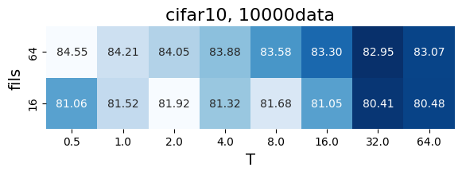

# 10/23

Wordのインデントがバグりまくる & 図の貼り付けがめんどすぎるので、
このNotionで作ったpdfで報告させてください…

- MN度合いを変化させると分類器の数が変化するため、
それらを合計した値(= Softmax に入力する値) のスケールが変化する
そのため、MN度合いが最適な温度パラメータTの値にあたえる影響は大きいのでは？
- 温度パラメータT と MN度合いの関係 について調査
    
    Model: Resnet18
    
    Dataset: CIFAR10, CIFAR100
    
    epochs = 200
    
    (fils, ensembles): [(64, 1), (16, 16)]
    
    T: [0.5, 1, 2, 4, 8, 16, 32, 64]
    
    data: [10000, 5000, 2500, 1000]
    データ数も変えて実験したが、TとMN度合いの関係に着目するため、考察は割愛
    ヒートマップは作ってあるので、ご興味あれば声をかけてください。
    

- 結果
    - 縦軸はMN度合い 横軸はT
    - ヒートマップの色は同じfils内で、T方向に比較したもの
- CIFAR10

- CIFAR100

- Calntech101 (以降先生の結果より)

- flowers102

- oxfordpet

- dtd

- gtsrb

- 考察
    - 最適なT(=T_opt)はT=1でない場合が多い。
        - cifar10, cifar100は、T=1の場合と比較してT_optの場合の精度は2%弱高い
        - データセットや学習環境によってはTによって精度が大きく変化する。
            - SGDの場合は顕著に変動する？Adamだと値がブレづらいかも？
            
            この場合、データセットの難易度が高いときに次のような傾向がみられる。
            
            - MN度合いを高めたときに精度が上昇する傾向がある。
            - T_optの値は大きい傾向にある （現時点の結果では信頼性低）
    - MN度合いを変化させたとき、T_optは変化する。
    その際、T_optの値が動く方向については、この実験結果からは傾向が見いだせない。

- 今後の方針
    - MNの分割数をより多様なパターンで検証 & 実験の試行回数を増やすことで、
    MN度合いとT_optの変化について明らかに
    - データセット（データセットの難易度 & データ数）と、T_optの変化について明らかに